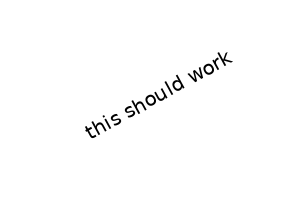
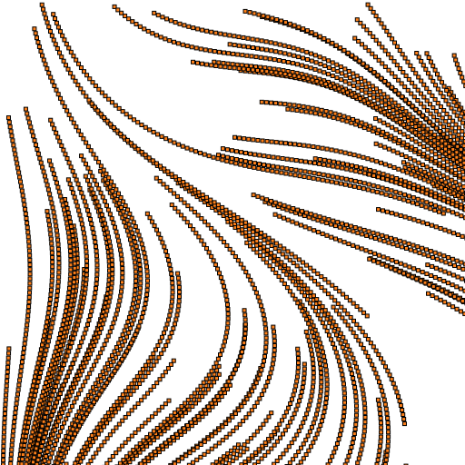
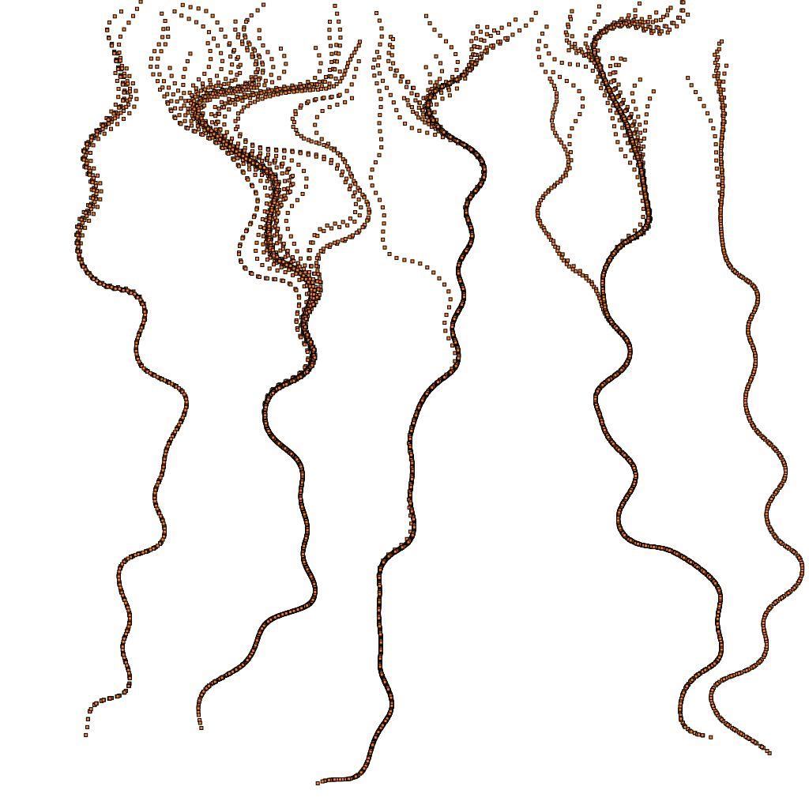
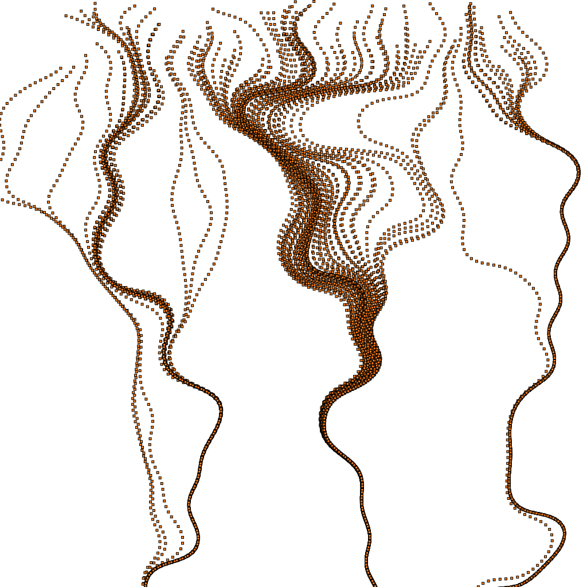
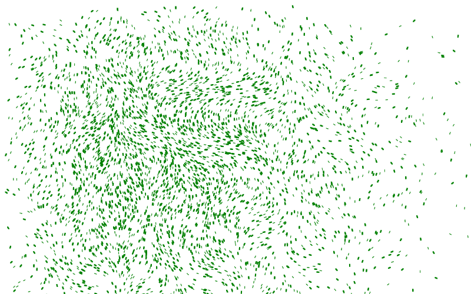

# Days Of Code
> A '100 days of code' style learning project


The goal here is to write small bits of code every weekday. I'm going to try and keep everything in Jupyter notebooks so that I can use NBDev to manage documenting it all and sharing code between days in case I want to build more complex things using building blocks from previous days. It should also make everything into a nice website at https://johnowhitaker.github.io/days_of_code/.

Here's a demo function defined in another notebook:

```python
demo_code() # Code defined in 00_core.ipynb, exported to 'core.py' and imported at the top of this NB
```


    'demo'


Code from multiple notebooks can go into the same eventual file. Here's a function from 01_Cairo_Hello.ipynb that does a bit of text with cairo and also gets exported to core.py

```python
hw_cairo('this should work')
```





# Sumary of the Journey

I set this up (configuring nbdev etc) one weekend so that I could dive straight in on the Monday and start coding. You can use the sidebar on the left to view the notebook for each day, but here I will try to summarise what was keeping me busy as this project unfolded.

### Week 1

Day 1 was getting used to cairo and doing some basic widget tests to get animation working to my satisfaction. Day 2 this cairo knowledge came in handy doing some visualizations for the AIcrowd [Multi-Agent BEhaviour Challenge](https://www.aicrowd.com/challenges/multi-agent-behavior-representation-modeling-measurement-and-applications) 


For day 2 and 3 I was pretty sidetracked with this competition, spending much more than an hour a day working on it. The resulting code is scattered across a bunch of notebooks in my Google Drive, but I will be documenting this process in a separate project to be released once that competition ends. 

On Friday (day 5) I decided I couldn't just use my competition playing as my 'days of code' requirement, so I switched things up and decided to try something I'd been meaning to look into for a while: Perlin noise. This is a topic that comes up a lot in generative art and graphics. It turns out the Wikipedia page was all I needed to get some cool images happening - by using perlin noise to steer particles and leave trails you can get some trippy images:
<table><tr>
<td> 
 </td>
<td> 
 </td>
<td> 
 </td>
</tr></table>

### Week 2

On day 6 I moved to ipycanvas hoping to make some interactive graphics stuff. It was good fun, and seeing thousands of circles move and shift and react to mouse clicks was satisfying. Sadly it doesn't leave an artefact that I can embed into these html docs, so you'll have to take my word for it or wait for my recap video(s) and make do with this static image for now:


Day 7 was a documentation day - I wrote the summary so far and tidied notebooks 1-6, making them easier to read and removing some duplicated cells and other cruft that was left over from the initial experimentation. I did write some code as I re-factored things, but it was mostly admin. I think this is important, and I will do 'documentation days' every week or two to keep things organised.


# Conclusion

This is going well so far - I will try to keep this updated :)
