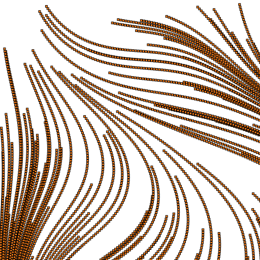
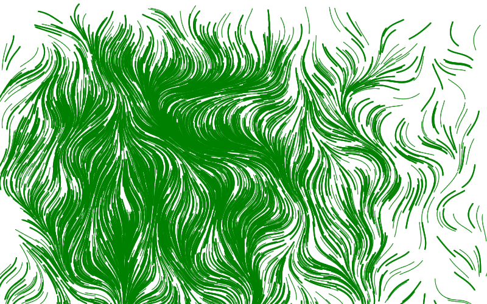

# Days Of Code
> A '100 days of code' style learning project


The goal here is to write small bits of code every weekday. I'm going to try and keep everything in Jupyter notebooks so that I can use NBDev to manage documenting it all and sharing code between days in case I want to build more complex things using building blocks from previous days. It should also make everything into a nice website at https://johnowhitaker.github.io/days_of_code/.

# Sumary of the Journey

I set this up (configuring nbdev etc) one weekend so that I could dive straight in on the Monday and start coding. You can use the sidebar on the left to view the notebook for each day, but here I will try to summarise what was keeping me busy as this project unfolded. I am also releasing summary videos on my [DataScienceCastnet channel](https://www.youtube.com/channel/UCP6gT9X2oXYcssfZu05RV2g). The first few are out:
- [Days of Code: Intro and Recap of the first few weeks](https://www.youtube.com/watch?v=gyPllP0S7iM)
- [Days of Code 2: WhistleGen - generating Irish music with machine learning](https://www.youtube.com/watch?v=B7SEP2p4Y1A)
- [Meet DotSwarm: A Slime-Mould-Inspired Shader](https://www.youtube.com/watch?v=mnuwd_z9YGE)
- [Competition Attempts: MABE Challenge first thoughts](https://www.youtube.com/watch?v=E5mSH1ajQkE)
- [Competition attempts: BirdClef 2021 Initial Approach](https://www.youtube.com/watch?v=Yd4YS5tu54I)


### Week 1

Day 1 was getting used to cairo and doing some basic widget tests to get animation working to my satisfaction. Day 2 this cairo knowledge came in handy doing some visualizations for the AIcrowd [Multi-Agent BEhaviour Challenge](https://www.aicrowd.com/challenges/multi-agent-behavior-representation-modeling-measurement-and-applications) 


For day 2 and 3 I was pretty sidetracked with this competition, spending much more than an hour a day working on it. The resulting code is scattered across a bunch of notebooks in my Google Drive, but I will be documenting this process in a separate project to be released once that competition ends. 

On Friday (day 5) I decided I couldn't just use my competition playing as my 'days of code' requirement, so I switched things up and decided to try something I'd been meaning to look into for a while: Perlin noise. This is a topic that comes up a lot in generative art and graphics. It turns out the Wikipedia page was all I needed to get some cool images happening - by using perlin noise to steer particles and leave trails you can get some trippy images:

<table style="margin: 0px auto;"><tr>
<td> 
 
</td>
<td> 
 </td>
</tr></table>

### Week 2

On day 6 I moved to ipycanvas hoping to make some interactive graphics stuff. It was good fun, and seeing thousands of circles move and shift and react to mouse clicks was satisfying. Sadly it doesn't leave an artefact that I can embed into these html docs, so you'll have to take my word for it or wait for my recap video(s) and make do with this static image for now:

<div style="width: 50%; display: block; margin-left: auto;  margin-right: auto;">

</div>

Day 7 was a documentation day - I wrote the summary so far and tidied notebooks 1-6, making them easier to read and removing some duplicated cells and other cruft that was left over from the initial experimentation. I did write some code as I re-factored things, but it was mostly admin. I think this is important, and I will do 'documentation days' every week or two to keep things organised.

You'll notice day 8 is missing - I did some playing with a separate project (TODO link birdio).

Days 9 and 10 I was playing with [my entry into the Hackaday Data Loggin' Contest](https://hackaday.io/project/178286-data-driven-mood-light). The data is a record of how many times a certain kind of event happened every day for the past few years. 

Day 9 was EDA and using cairo to try and make some pretty visualizations:

<table><tr>
<td> 
 </td>
<td> 
 </td>
</tr></table>

And day 10 took things 3D, using [SolidPython](https://github.com/SolidCode/SolidPython) (a python equivalent of OpenSCAD) to make some 3D shapes which I could then 3D print:

<table><tr>
<td> 
 </td>
<td> 
 </td>
</tr></table>

### Week 3

At the start of the week I met Observable. My first notebook there played with some of the same Perlin noise ideas as day 5. But since it's all JS this time I get interactive cell outputs that I can embed anywhere! Check it out:

```python
display(HTML("""
<iframe width="49%" height="400" frameborder="0"
  src="https://observablehq.com/embed/@johnowhitaker/meeting-observable?cells=p_zoom%2Cviewof+scale"></iframe>
<iframe width="49%" height="430" frameborder="0"
  src="https://observablehq.com/embed/@johnowhitaker/meeting-observable?cells=anim%2Cviewof+speed"></iframe>
"""))
```


<iframe width="49%" height="400" frameborder="0"
  src="https://observablehq.com/embed/@johnowhitaker/meeting-observable?cells=p_zoom%2Cviewof+scale"></iframe>
<iframe width="49%" height="430" frameborder="0"
  src="https://observablehq.com/embed/@johnowhitaker/meeting-observable?cells=anim%2Cviewof+speed"></iframe>


## Week 4 (ish)

I got really into shaders, and did some pretty cool things with them. My favourite exploration was the idea of slime-mould inspired simulations, with thousands (or millions - thanks to webgl) of agents move about leaving trails which can in turn affect their movement. This gives rise to all sorts of emergent behaviour - explore it in the full [observable notebook](https://observablehq.com/@johnowhitaker/dotswarm-exploring-slime-mould-inspired-shaders) or watch [my video](https://www.youtube.com/watch?v=mnuwd_z9YGE) for some pretty demos.

It was cool to make something that other people got interested in, and I was very pleasantly suprised when kind folks from the community chimed in with improvements and comments :)

```python
display(HTML("""
<iframe width="100%" height="876" frameborder="0"
  src="https://observablehq.com/embed/@johnowhitaker/dotswarm-exploring-slime-mould-inspired-shaders?width=400&height=400&n_power=16&initial_speed=0.2&speed_randomness=0.2&speed_multiplier=1&start_arrangement=Ring&wall_strat=Wrap&col_strat=Grey&blurr_fraction=1&fade_speed=0.05&vertex_radius=1&random_steer_factor=0.1&constant_steer_factor=0.4&trail_strength=0.2&search_radius=0.01&cells=viewof+gl"></iframe>
"""))
```


<iframe width="100%" height="876" frameborder="0"
  src="https://observablehq.com/embed/@johnowhitaker/dotswarm-exploring-slime-mould-inspired-shaders?width=400&height=400&n_power=16&initial_speed=0.2&speed_randomness=0.2&speed_multiplier=1&start_arrangement=Ring&wall_strat=Wrap&col_strat=Grey&blurr_fraction=1&fade_speed=0.05&vertex_radius=1&random_steer_factor=0.1&constant_steer_factor=0.4&trail_strength=0.2&search_radius=0.01&cells=viewof+gl"></iframe>


Webgl is very powerful but it also requires quite a bit of extra work to get up and running. Now that I have figured out at least some of the quirks, I anticipate returning to this for more experimentation in the future.

## Week 5 (ish)

We were travelling for a week or two, which meant a complete break from technology. I have resumed coding, but the daily experiments haven't suited the nbdev environment so I am going to link to them from here rather than coercing them into notebooks within this days_of_code project. The highlights:
- More shader experiments, gallery coming soon
- Starting work on an entry into the BirdClef 2021 challenge on kaggle. Blog post: https://datasciencecastnet.home.blog/2021/04/22/birdclef-entry-bird-call-classification-with-fastai/
- Polishing one of my earlier days of code notebooks to use as an example for interactive animations with ipycanvas: https://github.com/martinRenou/ipycanvas/pull/190
- Tidying up my half-finished introductory data science course: https://johnowhitaker.github.io/ds_zero/

Starting next week I'm hoping to move back to projects that suit this notebook format (although I may still play with observable and webgl on the side). 


# Conclusion

This is going well so far - I will try to keep this updated :)
